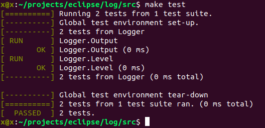
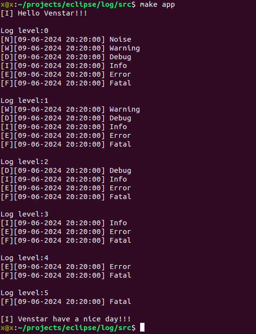

# Logger

  Dynamically configurable and portable logger with ability to expand output of the necessary information

## Build Google Testing Framework for your platform

  To compile source code you need the 'make', 'cmake' programs and 'g++' compiler. Make sure it is installed on your operating system. After that the following commands need to be executed:

```bash
  cd googletest-1.14.0
  cmake -S . -B build
  cmake --build build
  cd ..
  make test
```


## Build and execute demo application

```bash
  make app
```


## How to use

  When creating an object you must pass a pointer to callback function. Logs are passed to this function in parts.

```bash
  void to_stdout(string msg)
  {
    cout << msg;
  }

  int main()
  {
    logger log(to_stdout);
    ...
  }
```

  You can specify level that limits output of logs: Fatal, Error, Info, Debug, Warning, Noise. For example, Fatal level means that only fatal errors will be displayed. To add an extension pass into the list a pointer to callback function, in which you can implement what you want to see in the logs additionally.

```bash
  string ext_time()
  {
    auto t = time(nullptr);
    auto tm = *localtime(&t);

    ostringstream oss;
    oss << put_time(&tm, "%d-%m-%Y %H:%M:%S");
    auto str = oss.str();

    return str;
  }

  int main()
  {
    ...
    log.set_level(LOG_LEVEL_DEBUG);
    log.add_extension(ext_time);
    ...
  }
```
